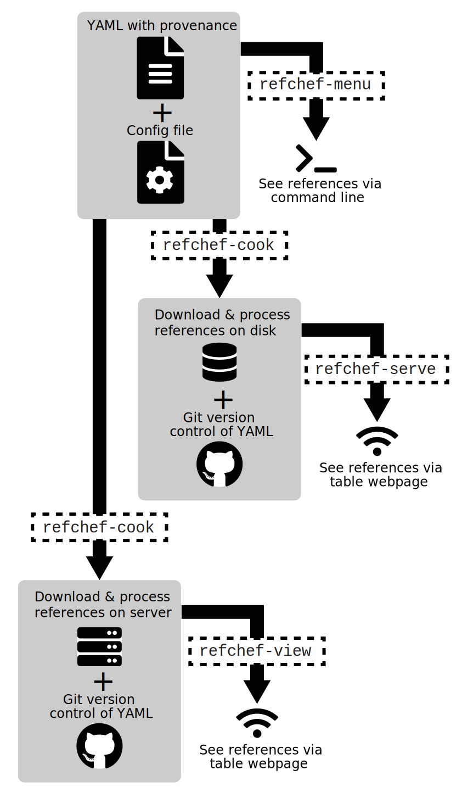

### RefChef - Genomic Reference Management Tool

 
  

---

`RefChef` is a reference management system that includes additional tools to record the provenance of reference sequences, indices, and annotations. It was created to enable reproducible research.       

`RefChef` will:       

1. Document the exact steps undertaken in the retrieval and processing of genomic references   
2. Maintain the associated metadata   
3. Provide a mechanism for automatically reproducing retrieval and creation of an exact copy of genomic references 

         
