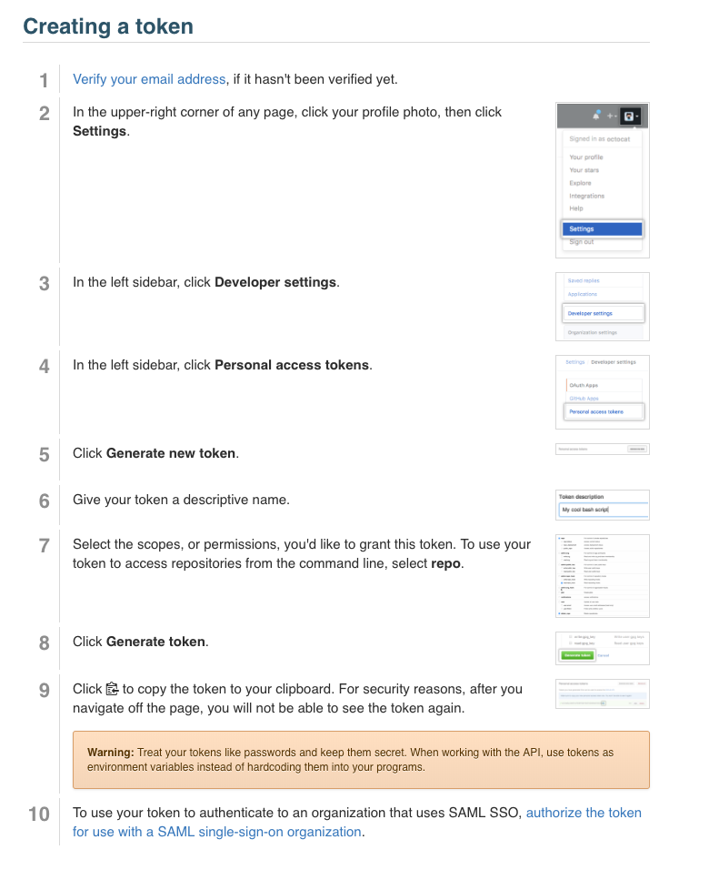

To install from PyPI using **pip**:  
`pip install refchef`

To install using **Anaconda Python**:  
`conda install -c compbiocore refchef`


### Development
To install a **development version** from the current directory:  
```bash
git clone https://github.com/compbiocore/refchef.git
cd refchef
pip install -e .
```

Run unit tests as:
`python setup.py test`

### Set up GitHub Access Token and `.env` file
RefChef uses Git and GitHub for version control of the `master.yaml` file, which contains a list of all the references on the system and their provenance. To use RefChef, create a GitHub account and set up an [access token](https://help.github.com/en/articles/creating-a-personal-access-token-for-the-command-line). 


Additionally, create a [`.gitignore` file](https://help.github.com/en/articles/ignoring-files)...

```bash
touch .gitignore
```

...and add `.env` to the `.gitignore` by pasting the following into the `.gitignore` file.

```bash
# ignore env files
*.env
```

Now create a `.env` file...
```bash
touch .env
```

... and paste the contents of the `.env.template` file in the `RefChef` home directory into the `.env` file, which will now look like this:

```bash
GITHUB_TOKEN=
```

Then, paste the GitHub access token into the `GITHUB_TOKEN=` line copied over from the `env.template` file. For example, your `.env` file might now look like this:

```bash
GITHUB_TOKEN=5c25370fcf7db4a676d98d72700e2922654485ed
```

## Contributing

Contributions consistent with the style and quality of existing code are
welcome. Be sure to follow the guidelines below.

Check the issues page of this repository for available work.

### Committing

This project uses [commitizen](https://pypi.org/project/commitizen/)
to ensure that commit messages remain well-formatted and consistent
across different contributors.

Before committing for the first time, install commitizen and read
[Conventional
Commits](https://www.conventionalcommits.org/en/v1.0.0-beta.2/).

```bash
pip install commitizen
```

To start work on a new change, pull the latest `develop` and create a
new *topic branch* (e.g. `feature-resume-model`,
`chore-test-update`, `bugfix-bad-bug`).

Add your changes to the current branch.
```bash
git add .
```

To commit your changes, run the following command (instead of `git commit`) and
follow the directions:

```bash
cz commit
```

#### Contact

email: cbc-help@brown.edu
