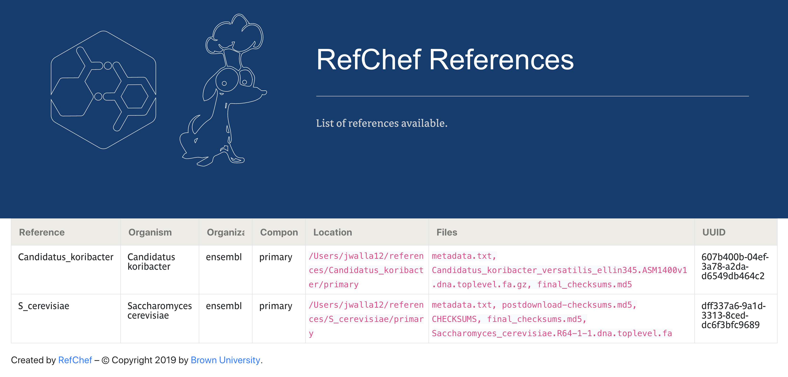

RefChef comes with the `refchef-serve` script. RefChef Serve uses Flask to create a minimal web interface with a list of references downloaded to the local system. It takes the argument `--master (-m)` or `--config -c` to find the local `master.yaml` file. RefChef serve will render a web interface with a filterable table containing all references, indices, and annotations.

Currently, the table shows only the following fields: reference name, species, organization, component, location of files, files, and UUID.

To render the application:
```shell
refchef-serve -m path/to/master.yaml
```
or
```shell
refchef-serve -c path/to/cfg.yaml
```

This will create and run the application that can be accessed at `http://127.0.0.1:5000`.

Here's an example:  


