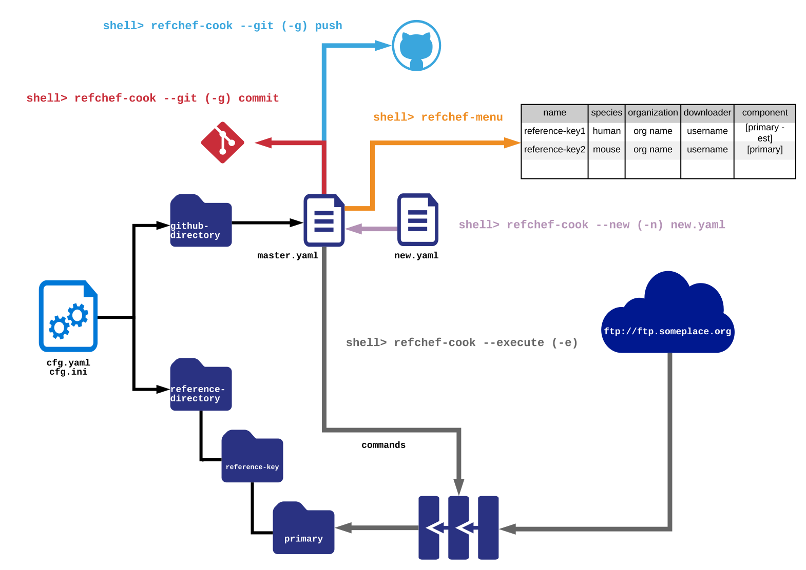
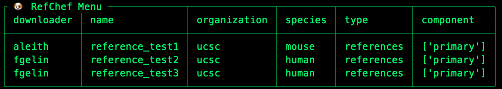
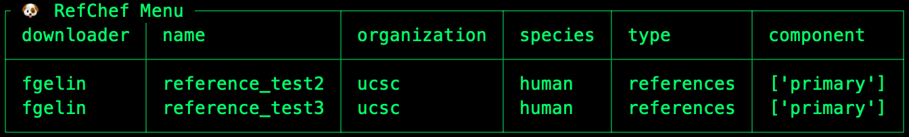

Create a master.yaml empty template, which yaml fields are required, is the master.yaml tested in anyway re: strings or numbers in the yaml, spell out the file paths in the documentation (like the primary folder is made from the component entry in master.yaml), make sure the install on oscar conda env is correct, we should make the final_checksums.md5 be a built-in, automatic aspect that doesn't need to be hard-coded at the end of master.yaml. What happens if I try to run refchef-cook without the execute flag?  It will add the commands to the master.yaml and you manually move the references? It should just append the information re: the commands you used to download the files to the master.yaml file without executing them if you don't set the -e flag. 


If you just want to add to master.yaml without executing 

## **Overview** 
RefChef is a reference management tool that helps make your next-generation sequencing projects and analyses reproducible. You can use it to document the provenance of reference genomes, transcriptomes, or proteomes downloaded from public databases (as well as their associated indices and annotations). It is a flexible workflow that could also be used to internally track the progress through different versions of draft assemblies. RefChef will: 
1. document the exact steps undertaken in the retrieval and processing of genomic references; 
2. maintain the associated metadata; (3) provide a mechanism for automatically reproducing retrieval and creation of an exact copy of genomic references.

**RefChef comes with two commands:**      

&nbsp;&nbsp;&nbsp;&nbsp;&nbsp;&nbsp;[**`refchef-cook`**](#refchef-cook):     
&nbsp;&nbsp;&nbsp;&nbsp;&nbsp;&nbsp; Will read recipes and execute the commands that will retrieve the references, indices, or   
&nbsp;&nbsp;&nbsp;&nbsp;&nbsp;&nbsp; annotations based on the contents of [`master.yaml`](#master.yaml).     

&nbsp;&nbsp;&nbsp;&nbsp;&nbsp;&nbsp;[**`refchef-menu`**](#refchef-menu):   
&nbsp;&nbsp;&nbsp;&nbsp;&nbsp;&nbsp; Provides a way for the user to list all references present in the system, based   
&nbsp;&nbsp;&nbsp;&nbsp;&nbsp;&nbsp; on [`master.yaml`](#master.yaml), as well as filter the list of references based on metadata options. 



**RefChef requires a `master.yaml` file:**      

In addition to the [`refchef-cook`](#refchef-cook) and [`refchef-menu`](#refchef-menu) commands, RefChef requires a [`master.yaml`](#master.yaml) containing a list of references, indices, annotations, and metadata, as well as the commands necessary to download and process the files. When [`refchef-cook`](#refchef-cook) is executed, RefChef will append the [`master.yaml`](#master.yaml) to change the `complete` option from `false` to `true`and will also add a `uuid` for each reference, the date the files were downloaded and their location, as well as a complete list of files. Based on the arguments you pass to [`refchef-cook`](#refchef-cook), it will either commit those changes to [`master.yaml`](#master.yaml) to a local repository (red arrow in the above figure) or commit and push the changes to a remote repository (blue arrow in the above figure). 

**RefChef requires configuration information:**      

[`refchef-cook`](#refchef-cook) and [`refchef-menu`](#refchef-menu) both require some configuration information, including:

1. Where you'd like the references to be saved 
2. The local git repository for version control of references
3. The remote github repository for version control of reference
  sequences (optional).

This information can be specified in a [`cfg.yaml`](#cfg.yaml) file, a [`cfg.ini`](#cfg.ini) file, or it can be passed as arguments to [`refchef-cook`](#refchef-cook). 

## **Quickstart**
[Create a remote repository.](https://help.github.com/en/articles/creating-a-new-repository) and [clone it.](https://help.github.com/en/articles/cloning-a-repository)

```
git clone https://github.com/JRWallace/remote_references.git
```

Create a directory for refchef to store your references:
```
mkdir /Volumes/jwalla12/references
```

Create a [`master.yaml`](#master.yaml) file and save it in your local git repository directory. Here is a [`master.yaml`](#master.yaml) file that will download chromosome 1 of the grch38 human genome from Ensembl:

```
grch38:
  metadata:
    common_name: human
    ncbi_taxon_id: 9606
    organism: homo sapiens
    organization: ensembl
    custom: no
    description: corresponds to ganbank id GCA_000001405.22
    downloader: joselynn wallace
    ensembl_release_number: 87
    accession:
      genbank:
      refseq:
  levels:
    references:
    - component: primary
      complete:
        status: false
      commands:
      - wget ftp://ftp.ensembl.org/pub/release-87/fasta/homo_sapiens/dna/Homo_sapiens.GRCh38.dna.chromosome.1.fa.gz
      - wget ftp://ftp.ensembl.org/pub/release-87/fasta/homo_sapiens/dna/CHECKSUMS
      - md5 *.gz > postdownload-checksums.md5
      - gunzip *.gz
      - md5 *.* > final_checksums.md5

```
Pass the configuration arguments in a config file or directly to [`refchef-cook`](#refchef-cook) (as seen in the following example):

```
refchef-cook -e -o /Volumes/jwalla12/references -gl /Volumes/jwalla12/remote_references/remote_references -gr jrwallace/remote_references -g commit
```

After [`refchef-cook`](#refchef-cook) is run, [`master.yaml`](#master.yaml) will reflect that you have downloaded the references and it will now look like this:

```
grch38:
  metadata:
    name: grch38
    common_name: human
    ncbi_taxon_id: 9606
    organism: homo sapiens
    organization: ensembl
    custom: false
    description: corresponds to ganbank id GCA_000001405.22
    downloader: joselynn wallace
    ensembl_release_number: 87
    accession:
      genbank: null
      refseq: null
  levels:
    references:
    - component: primary
      complete:
        status: true
        time: 2019-07-18 14:43:33.302255
      commands:
      - wget ftp://ftp.ensembl.org/pub/release-87/fasta/homo_sapiens/dna/Homo_sapiens.GRCh38.dna.chromosome.1.fa.gz
      - wget ftp://ftp.ensembl.org/pub/release-87/fasta/homo_sapiens/dna/CHECKSUMS
      - md5 *.gz > postdownload-checksums.md5
      - gunzip *.gz
      - md5 *.* > final_checksums.md5
      location: /Volumes/jwalla12/references/grch38/primary
      files:
      - CHECKSUMS
      - final_checksums.md5
      - Homo_sapiens.GRCh38.dna.chromosome.1.fa
      - metadata.txt
      - postdownload-checksums.md5
      uuid: ce305c7a-7473-30da-b7e5-7d4fd9185975

```

To add more files (we will add a bwa index), create a new branch. Here, we make a branch called 'bwa_index_grch38':
```
git checkout -b bwa_index_grch38
```

Create a `new.yaml` file to append new reference indexes to the `master.yaml`.

```
grch38_index:
  metadata:
    name: grch38_index
    common_name: human
    ncbi_taxon_id: 9606
    organism: homo sapiens
    organization: ensembl
    custom: no
    description: corresponds to ganbank id GCA_000001405.22
    downloader: joselynn wallace
    ensembl_release_number: 87
    accession:
      genbank:
      refseq:
  levels:
    references:
    - component: bwa_index
      complete:
        status: false
      src: ce305c7a-7473-30da-b7e5-7d4fd9185975
      commands:
      - mkdir 
      - bwa index /Volumes/jwalla12/references/grch38/primary/Homo_sapiens.GRCh38.dna.chromosome.1.fa.gz
```

Then use [`refchef-cook`](#refchef-cook)

```
refchef-cook -e -o /Volumes/jwalla12/references -gl /Volumes/jwalla12/remote_references/remote_references -gr jrwallace/remote_references -n /Volumes/jwalla12/remote_references/remote_references/new.yaml -g commit
```

Then try [`refchef-menu`](#refchef-menu)

```
refchef-menu -f /Volumes/jwalla12/remote_references/remote_references/master.yaml
```
Which will show you:

```
  dict_ = yaml.load(yml)
┌ 🐶 RefChef Menu ────────────┬───────────┬────────────────────────────────────────────┬──────────────────────────────────────┐
│ name         │ organism     │ component │ description                                │ uuid                                 │
├──────────────┼──────────────┼───────────┼────────────────────────────────────────────┼──────────────────────────────────────┤
│ grch38       │ homo sapiens │ primary   │ corresponds to ganbank id GCA_000001405.22 │ ad4140d7-7dd8-3bb9-87e5-4208502d5a72 │
│ grch38_index │ homo sapiens │ bwa_index │ corresponds to ganbank id GCA_000001405.22 │ fa25201e-a994-11e9-a88c-8c8590bd206d │
└──────────────┴──────────────┴───────────┴────────────────────────────────────────────┴──────────────────────────────────────┘

```

Checkout the master branch and merge your new branch into master:

```
git checkout master
git merge bwa_index_grch38

```

## **Usage**


## refchef-cook <a name="refchef-cook"></a>   
Reads recipes and executes the commands that will retrieve the references, indices, or annotations.    

**Usage:**   
`refchef-cook [*arguments*]`   

**Arguments:**  
`--execute, -e`: will execute all commands listed in the `master.yaml` for each reference, if reference doesn't exist in the location provided in the config file.  
`--new, -n`: path to a new yaml file containing other references to be downloaded and appended to the `master.yaml`.   
`--git, -g`: Git action. Choose from `commit` or `push`.   
`--outdir, -o`: output directory, where references will be downloaded to.   
`--git_local, -gl`: Local git directory, where the `master.yaml` file can be found.   
`--git_remote, -gr`: Remote git repository, in the format `user/project_name`.   
`--logs, -l`: Whether to save the log files.   

**Example:**  
  1 - This will read in `new.yaml` file, append to `master.yaml` and commit the changes using git.
    `refchef-cook --config /path/to/cfg.yaml --execute --new new.yaml --git commit`.

  2 - This will process `master.yaml`, commit and push changes to the remote repository:  
    `refchef-cook --execute -o /path/to/output/dir --git_local /path/to/git/dir --git_remote user/project_name --git push`


## refchef-menu <a name="refchef-menu"></a>   
This command provides a way for the user to list all references present in the system, based on `master.yaml`, as well as filter the list of references based on metadata options. You must specify either `--master, -m` or `--config, -c` 

**Usage:**   
`refchef-cook [*arguments*]`

**Arguments:**.    
`--master, -m`: path to `master.yaml` file. Must be used if `--config` argument is not used.   
`--filter`: used to filter references based on metadata. Takes a pair key:value, or a list of pairs separated by comma: `key:value,key2:value2,key3:value3...`   
`--full`: whether to show the full table including files and location of files     

**Example:**
`refchef-menu`



`refchef-menu --filter species:human`



## **Inputs**
## master.yaml <a name="master.yaml"></a> 

Example `master.yaml` before processing:  

```yaml
grch38:   
  metadata:   
    common_name: human   
    ncbi_taxon_id: 9606
    organism: homo sapiens
    organization: ensembl
    custom: no
    description: corresponds to ganbank id GCA_000001405.22
    downloader: joselynn wallace
    ensembl_release_number: 87
    accession:
      genbank:
      refseq:
  levels:
    references:
    - component: primary
      complete:
        status: false
      commands:
      - wget ftp://ftp.ensembl.org/pub/release-87/fasta/homo_sapiens/dna/Homo_sapiens.GRCh38.dna.chromosome.1.fa.gz
      - wget ftp://ftp.ensembl.org/pub/release-87/fasta/homo_sapiens/dna/CHECKSUMS
      - md5 *.gz > postdownload-checksums.md5
      - gunzip *.gz
      - md5 *.* > final_checksums.md5
```
In the above `master.yaml` file, `grch38` is the reference name, which is a required entry in the `master.yaml` file. 

The next chunk (`metadata`) contains the following fields:
`common_name`: Required, can be any commonly used name for your reference.
`ncbi_taxon_id`: Required, see the [NCBI taxonomy browser](https://www.ncbi.nlm.nih.gov/Taxonomy/Browser/wwwtax.cgi) for more information. If your organism doesn't have an NCBI taxonomy assignment (for example, it is a metagenome) you can fill in any other string for this entry (for example, `none` rather than `9606`).
`organism`: Required, can be any string including genus, species, or strain level information. 
`organization`: Required, should convey information about which organization was the source of your reference genome (`ensembl`, `refseq`, etc.)


Example `master.yaml` after processing:  
```yaml
reference_test1:
  metadata:
    name: reference_test1
    species: mouse
    organization: ucsc
    downloader: fgelin
  levels:
    references:
    - component: primary
      complete:
        status: true
        time: 2018-12-20 11:14:13.153237
      commands:
      - wget -nv https://s3.us-east-2.amazonaws.com/refchef-tests/chr1.fa.gz
      - md5 *.fa.gz > postdownload_checksums.md5
      - gunzip *.gz
      - md5 *.fa > final_checksums.md5
      location: refchef-data/reference_test1/primary
      files:
      - chr1.fa
      - metadata.txt
      - postdownload_checksums.md5
      - final_checksums.md5
      uuid: 8040b09f-3844-3c42-b765-1f6a32614895
```


## cfg.yaml <a name="cfg.yaml"></a> 

`cfg.yaml`:
```yaml
config-yaml:
  path-settings:
    reference-directory: ~/data/references_dir # directory where references will be downloaded and processed.
    git-directory: ~/data/git_local # local git repository where `master.yaml` is located.
    remote-repository: user/repo # remote user and repository for version control of `master.yaml`
  log-settings:
    log: 'yes'
```

## cfg.ini <a name="cfg.ini"></a> 

`cfg.ini`:
```toml
[path-settings]
reference-directory=~/data/references_dir #directory where references will be downloaded and processed.
git-directory=~/data/git_local #local git repository where `master.yaml` is located.
remote-repository=user/repo # remote user and repository for version control of `master.yaml`
[log-settings]
log=yes
[runtime-settings]
break-on-error=yes
verbose=yes
```


