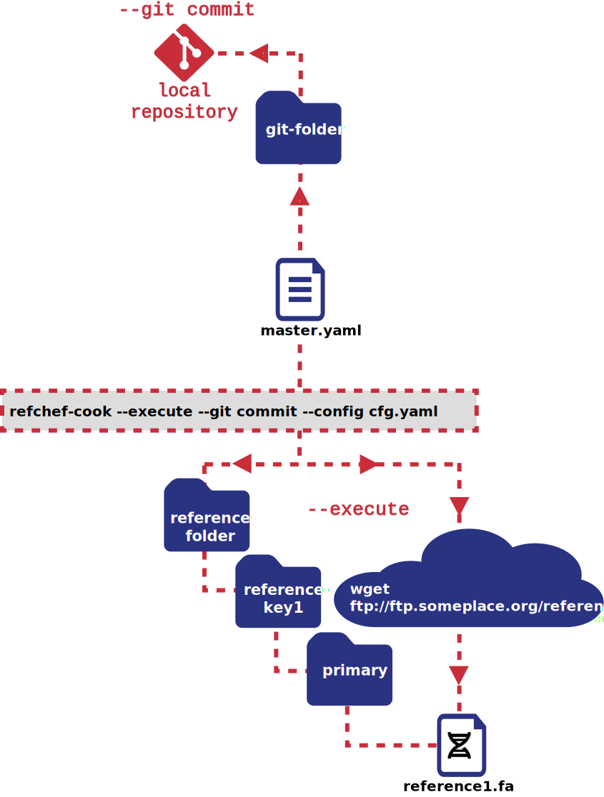

###**Download reference, local repository `master.yaml` version control:**
  
###**Download reference, remote repository `master.yaml` version control:**
  
###**Download new reference, local repository `master.yaml` version control:**
  
###**Add manually downloaded reference, append commands to master.yaml, do not execute commands, local repository `master.yaml` version control:**

###**refchef-menu to view references available on the system:**
  
